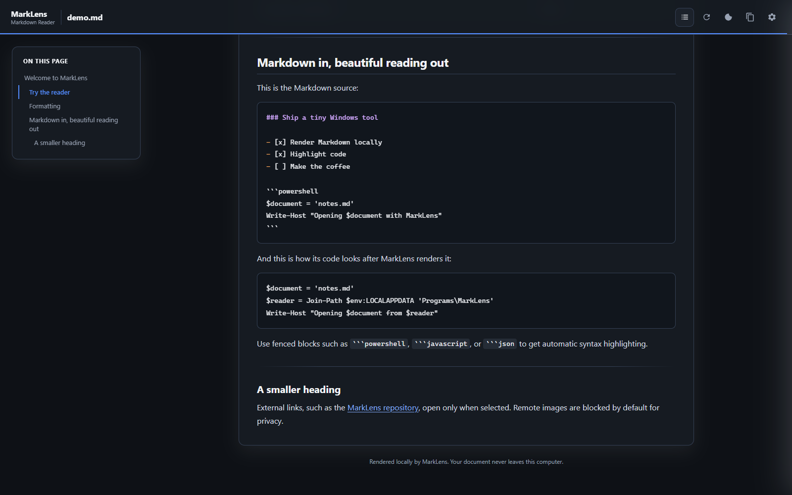
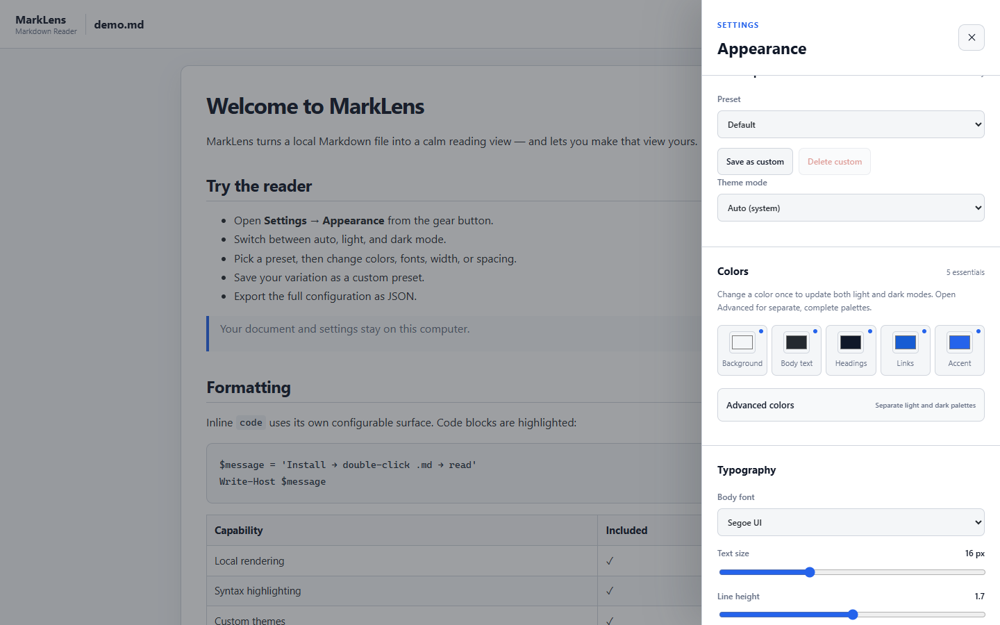

# MarkLens — Markdown Reader for Windows

> **A free, open-source Markdown reader and Markdown viewer for Windows 10 and 11.**

[](https://github.com/KonradKazimierowicz/MarkLens/releases/latest/download/MarkLens-Setup-v1.1.0.exe)


MarkLens opens `.md` and `.markdown` files in a calm desktop reading view. It supports GitHub-flavored Markdown, syntax highlighting, dark mode, custom themes, and Windows file associations.

No account, advertisements, telemetry, cloud storage, administrator rights, or internet connection are required.

## Start in three steps

1. [Download `MarkLens-Setup-v1.1.0.exe`](https://github.com/KonradKazimierowicz/MarkLens/releases/latest/download/MarkLens-Setup-v1.1.0.exe).
2. Run the installer, then choose MarkLens for `.md` and `.markdown` on the Windows Default Apps page that opens.
3. Double-click any Markdown file.

Windows may ask which application should open Markdown the first time. Choose **MarkLens** and enable **Always**.

> The version 1.x installer is unsigned. SmartScreen may show a warning, while Smart App Control can block unsigned apps entirely. Verify the [SHA-256 checksum](https://github.com/KonradKazimierowicz/MarkLens/releases/latest/download/MarkLens-Setup-v1.1.0.exe.sha256) and read [Troubleshooting](docs/TROUBLESHOOTING.md).

Need more detail? Read the [installation guide](docs/INSTALLATION.md) or [troubleshooting guide](docs/TROUBLESHOOTING.md).

## Read Markdown, not editor chrome

MarkLens turns local notes, documentation, README files, technical guides, and code-heavy Markdown into a focused reading surface.



## Why MarkLens?

- **Native Windows flow:** double-click Markdown in File Explorer.
- **Offline by default:** documents and settings stay on this computer.
- **GitHub-flavored Markdown:** tables, task lists, quotes, links, and fenced code.
- **Syntax highlighting:** readable code blocks without an editor.
- **Light and dark modes:** manual or system-aware theme selection.
- **Live customization:** colors, typography, spacing, width, and component styles.
- **Portable settings:** custom presets plus JSON import and export.
- **Print preview:** an ink-friendly document view with readable code, tables, links, and page breaks.
- **Lightweight installation:** per-user setup with no administrator rights.

## Make the Markdown viewer yours

The main Appearance view keeps five essential colors visible: **Background, Body text, Headings, Links, and Accent**. One change updates both light and dark modes.

Open **Advanced colors** for complete, independent palettes. Advanced typography and layout controls stay available without crowding the everyday settings.



## Markdown and code support

MarkLens renders GitHub-flavored Markdown locally with Marked, sanitizes the result with DOMPurify, and highlights fenced code with highlight.js.

The included [demo document](sample/demo.md) shows raw Markdown beside its rendered result:

````markdown
## Release check

- [x] Open Markdown locally
- [x] Highlight fenced code

```powershell
Get-FileHash .\MarkLens-Setup-v1.1.0.exe -Algorithm SHA256
```
````

## Local-first privacy and security

Markdown content never leaves the computer. A small local bridge binds only to `127.0.0.1` so the browser-based settings panel can save configuration.

A restrictive Content Security Policy blocks scripts, frames, objects, remote images, and network connections. Relative images are confined to the opened document directory.

Read the [privacy policy](PRIVACY.md) and [security policy](SECURITY.md) for the complete model and private vulnerability reporting.

## Help and documentation

- [Install, update, or uninstall](docs/INSTALLATION.md)
- [Fix common problems](docs/TROUBLESHOOTING.md)
- [Configure themes, layout, and branding](docs/CONFIGURATION.md)
- [Browse all documentation](docs/README.md)
- [Report a bug](https://github.com/KonradKazimierowicz/MarkLens/issues/new?template=bug_report.yml)
- [Request a feature](https://github.com/KonradKazimierowicz/MarkLens/issues/new?template=feature_request.yml)

## For developers

Clone and launch the demo:

```powershell
git clone https://github.com/KonradKazimierowicz/MarkLens.git
cd MarkLens
npm ci --ignore-scripts
powershell.exe -NoProfile -ExecutionPolicy Bypass -File .\app\MarkLens.ps1 -Path .\sample\demo.md
```

Run the complete verification suite:

```powershell
powershell.exe -NoProfile -ExecutionPolicy Bypass -File .\tests\run-tests.ps1
powershell.exe -NoProfile -ExecutionPolicy Bypass -File .\tools\verify-vendor.ps1
```

Build the Windows installer locally:

```powershell
powershell.exe -NoProfile -ExecutionPolicy Bypass -File .\tools\build-installer.ps1
```

The project intentionally uses a local, manual release process and does not require GitHub Actions.

## Repository layout

```text
app/        MarkLens runtime and reader interface
docs/       User and contributor documentation
installer/  Per-user Windows installer entry point
sample/     Safe Markdown demo files
tests/      PowerShell and real-browser verification
tools/      Installer build and dependency checks
```

See the [architecture](docs/ARCHITECTURE.md), [roadmap](docs/ROADMAP.md), and [contributing guide](CONTRIBUTING.md).

MarkLens is free and open source under the [MIT License](LICENSE). Third-party notices are listed in [THIRD_PARTY_NOTICES.md](THIRD_PARTY_NOTICES.md).
